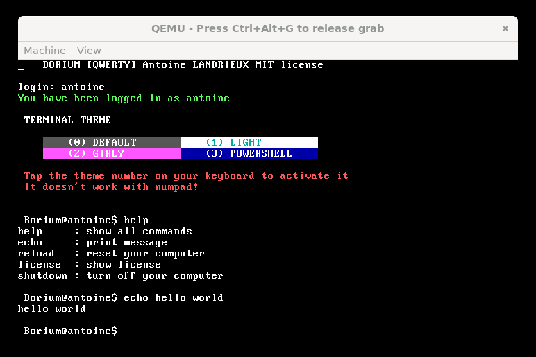

#  BORIUM

SOARE and BORIUM are distributed under the [MIT License](LICENSE).

---



[**➡️ See more pictures**](resources/github/README.md)

## 📖 Documentation

> [!IMPORTANT]  
> See [BORIUM Documentation](doc/documentation.md)
>
> See [SOARE Documentation](https://github.com/AntoineLandrieux/SOARE/blob/main/doc/documentation.md)
>

## 🧑‍💻 INTERPRETER

```txt
? This is your first SOARE code !
write "Hello World!";
```

## 🤲 Contributing

The BORIUM source code is located in the Git repository at [github.com/AntoineLandrieux/BORIUM](https://github.com/AntoineLandrieux/BORIUM/).
Contributions are most welcome by forking the repository and sending a pull request.

## 📜 Credit

See **[AUTHORS file](AUTHORS)**

**Contributors :**


