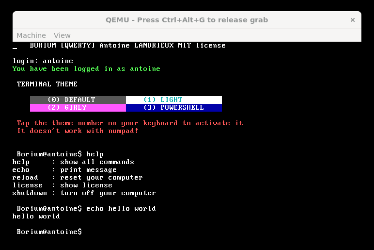

# BORIUM (БОРИЙ)

## Simple Operating System

LDRX is distributed under the [MIT LICENSE](LICENSE).

---

## Documentation

See **[LDRX Documentation](doc/documentation.md)**

## Contributing

The BORIUM source code is located in the Git repository at [github.com/AntoineLandrieux/BORIUM](https://github.com/AntoineLandrieux/BORIUM/).
Contributions are most welcome by forking the repository and sending a pull request.

## Credit

See **[AUTHORS file](AUTHORS)**
