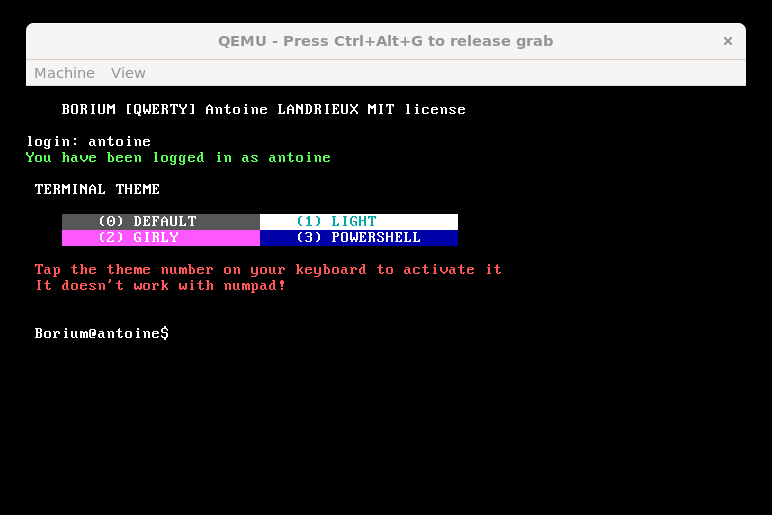
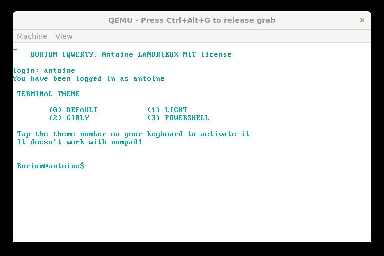
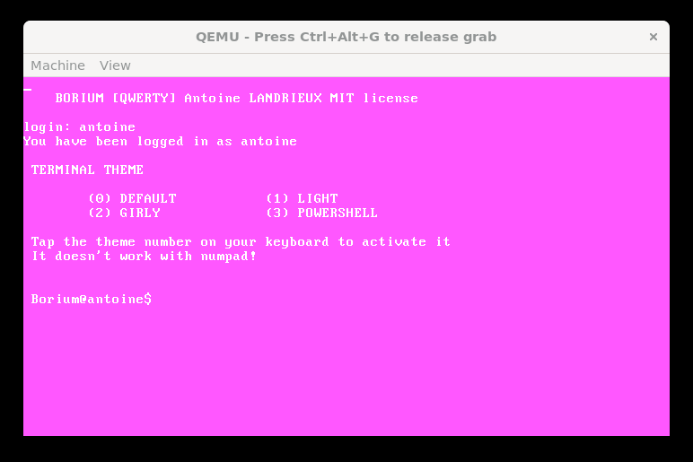
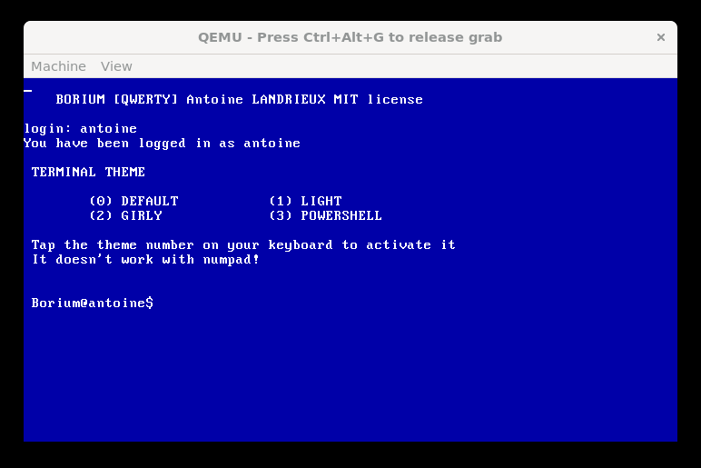

# BORIUM DOC

---

## COMPILER

### TOOLS

> Here we will use a Linux environment.

```sh
apt-get update && apt-get upgrade

apt-get install nasm
apt-get install qemu-system
apt-get install build-essential
```

### COMPILE AND RUN

After installing the OS compilation tools,
You can compile and run the OS with these commands:

```sh
make && make run
```

And then, you can delete the binary files by doing:

```sh
make clean
```

---

## HOW TO USE

### SELECT A THEME

Borium can offer you 4 different themes

>
> **Default**
>
> 
>
> **Light**
>
> 
>
> **Girly**
>
> 
>
> **Powershell**
>
> 
>

You can choose 1 of the 4 using the 0, 1, 2, 3 keys on your keyboard (does not work with the numpad)
